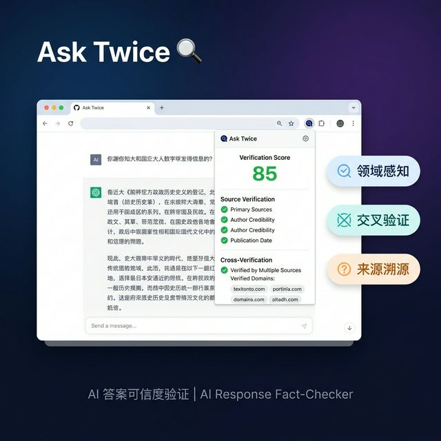
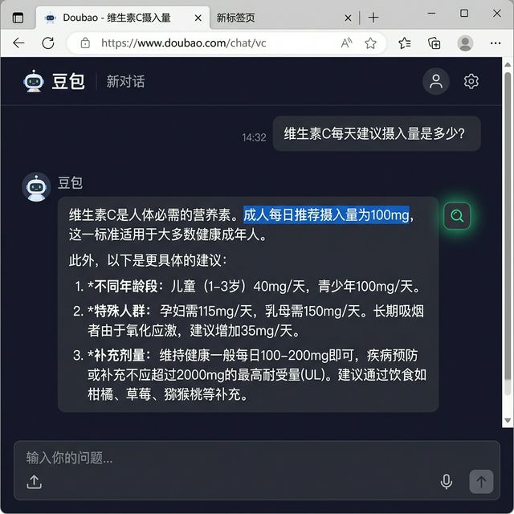
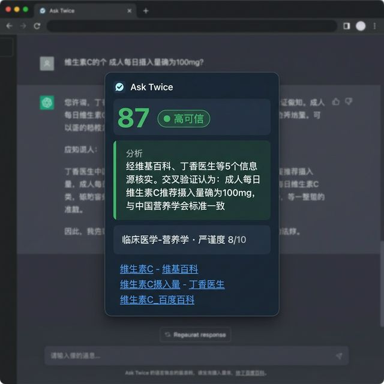

# Ask Twice 🔍

<p align="center">
  
</p>

<p align="center">
  <strong>AI 答案可信度验证浏览器插件 — 让你每次用 AI，都能"再问一遍"确认</strong><br>
  <em>AI Response Fact-Checker Chrome Extension — Verify AI answers with cross-verification</em>
</p>

<p align="center">
  <a href="https://github.com/mojiQAQ/asktwice/stargazers"></a>
  
  
  
  
</p>

## 演示

<p align="center">
  
  &nbsp;&nbsp;
  
</p>

<p align="center">
  <em>① 选中 AI 回答中的文字 → ② 点击验证 → ③ 查看综合分析和来源</em>
</p>

## 功能

- **领域感知声明验证** — 自动识别声明所属领域（医学/法律/金融/科学…），动态调整验证严谨度
- **来源溯源评分** — 搜索验证来源并评估权威度，给出可信度评分
- **LLM 交叉验证** — 用独立 LLM 调用"再问一遍"，对比原始回答是否靠谱
- **利益冲突检测** — 识别 AI 回答中的商业推荐和利益冲突
- **对话上下文理解** — 基于完整对话历史理解选中内容的完整语义

## 快速开始

### 1. 启动后端

```bash
cd server
cp .env.example .env
# 编辑 .env，填入你的 OPENAI_API_KEY 和 BRAVE_API_KEY

pip install -r requirements.txt
python main.py
```

后端将在 `http://localhost:8001` 启动

### 2. 加载 Chrome 插件

1. 打开 Chrome，访问 `chrome://extensions/`
2. 开启右上角「开发者模式」
3. 点击「加载已解压的扩展程序」
4. 选择 `extension/` 目录
5. 访问 [豆包](https://www.doubao.com) 或 [ChatGPT](https://chatgpt.com)

### 3. 使用

1. 在 AI 页面中选中一段回答文字（≥5 字）
2. 鼠标释放后，Ask Twice 图标出现在选中位置
3. 点击图标 → 自动验证 → 浮窗展示结果

## 验证流程

```
用户选中 AI 回答中的文字
       │
  ┌────▼────┐
  │ 声明分析  │  LLM 基于对话上下文补全语义 → 领域识别 → 严谨度分级
  └────┬────┘
       │
  ┌────▼──────────────────────────────┐
  │         并发执行 3 个验证通道       │
  │  ┌──────────┬──────────┬────────┐ │
  │  │ 来源验证  │ 交叉验证  │ 冲突检测│ │
  │  │(搜索API) │(独立LLM) │(LLM)   │ │
  │  └─────┬────┴─────┬────┴───┬────┘ │
  └────────┼──────────┼────────┼──────┘
           │          │        │
      ┌────▼──────────▼────────▼────┐
      │     领域加权综合评分          │
      │  搜索/交叉权重按证据类型调整   │
      └─────────────┬───────────────┘
                    │
              浮窗展示结果
```

## 评分体系

| 分数 | 等级 | 含义 |
|-----|------|------|
| 80-100 | 🟢 高可信 | 多个权威来源验证 + 交叉验证认同 |
| 60-79 | 🟡 待验证 | 有来源但权威度不够 |
| 40-59 | 🟠 低可信 | 来源薄弱或存在矛盾 |
| 0-39 | 🔴 不可信 | 无可靠来源 |

## 项目结构

```
asktwice/
├── docs/                 # 文档
│   ├── architecture.md   # 代码架构设计 (v2.0)
│   ├── prd.md            # 产品需求文档
│   ├── competitive_analysis.md
│   ├── feasibility_analysis.md
│   ├── intro.md
│   └── aurascape.md
│
├── extension/            # Chrome 浏览器插件
│   ├── manifest.json
│   ├── content/          # 注入 AI 页面的脚本和 UI
│   │   ├── ui/selection-bubble.js  # 划词验证（核心交互）
│   │   └── platforms/              # 平台适配层
│   ├── background/       # Service Worker（API 通信 + 缓存）
│   ├── popup/            # 弹出页
│   └── shared/           # 前端共享模块
│
└── server/               # 后端 API 服务 (FastAPI)
    ├── main.py
    ├── api/verify.py     # POST /api/verify
    ├── services/
    │   ├── claim_analyzer.py    # 声明理解 + 领域识别
    │   ├── cross_verifier.py    # LLM 交叉验证
    │   ├── source_verifier.py   # 来源验证（领域感知）
    │   ├── conflict_detector.py # 利益冲突检测
    │   └── score_calculator.py  # 综合评分（领域加权）
    ├── models/            # 数据模型
    └── utils/             # 缓存、搜索封装
```

## 技术栈

| 组件 | 技术 |
|------|------|
| 浏览器插件 | Chrome Extension Manifest V3 |
| 后端 | Python FastAPI |
| LLM | GPT-4o-mini (OpenAI 兼容) |
| 搜索 | Brave Search API |

## 环境变量

```env
OPENAI_API_KEY=你的密钥
OPENAI_BASE_URL=https://api.openai.com/v1
OPENAI_MODEL=gpt-4o-mini
BRAVE_API_KEY=你的密钥
PORT=8001
```

## 文档

| 文档 | 说明 |
|------|------|
| [架构设计](docs/architecture.md) | 代码架构、验证流程、领域评分机制 |
| [产品需求](docs/prd.md) | PRD、功能规格、商业模式 |
| [竞品分析](docs/competitive_analysis.md) | Facticity.AI 等竞品对比 |
| [可行性分析](docs/feasibility_analysis.md) | 技术/商业可行性 |
| [项目介绍](docs/intro.md) | 创意来源与背景 |

## License

MIT
